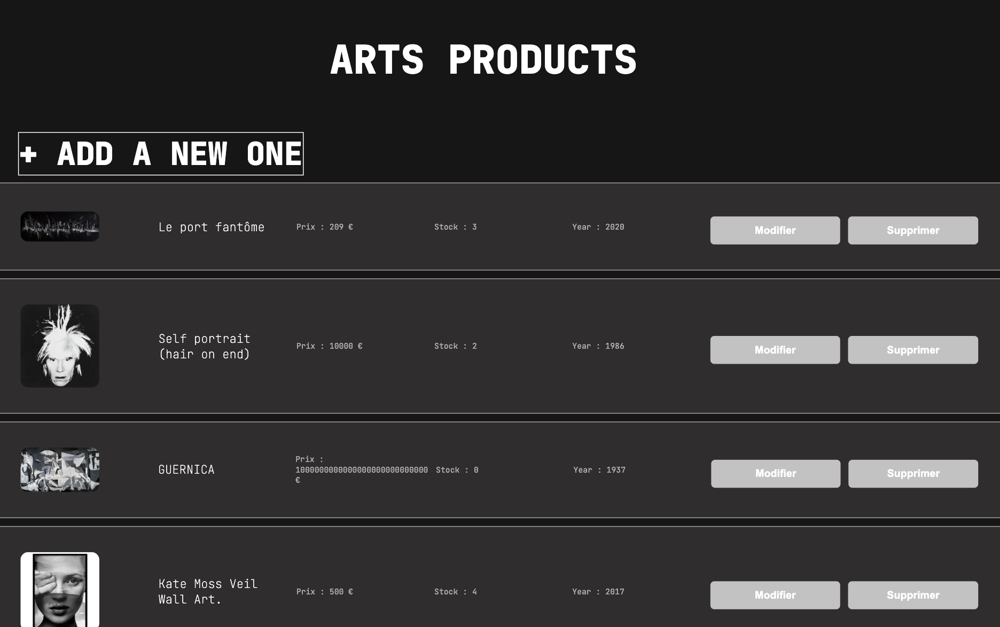
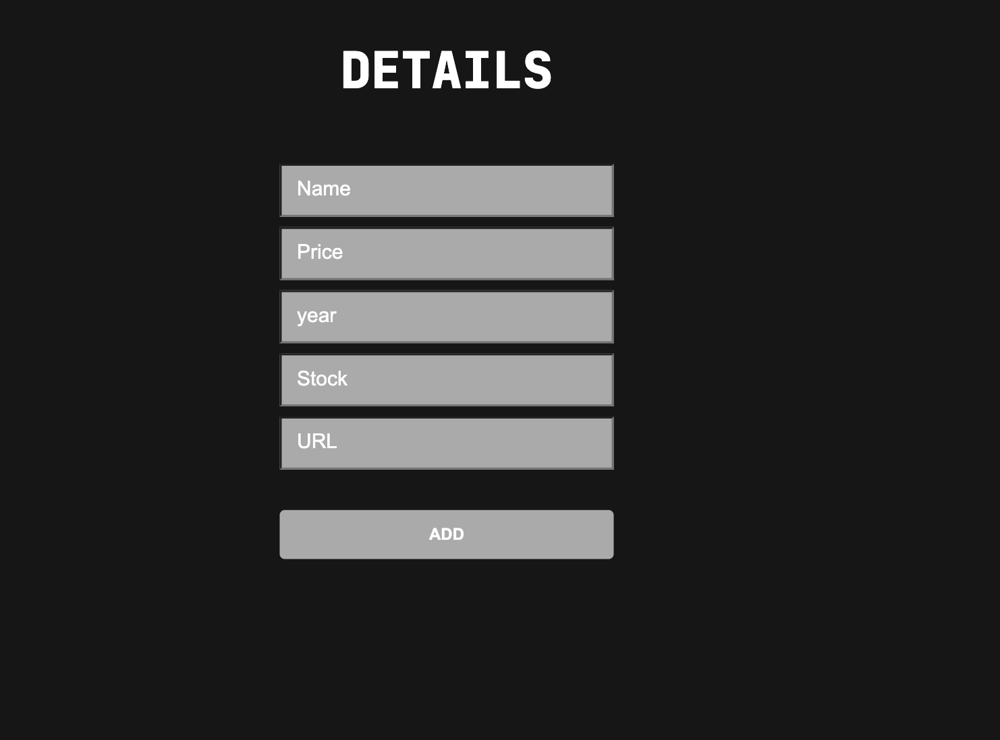

# 🎨 Art Stock Management App

##📌 description

This is an Art Stock Management App built using React and Vite. The application allows users to manage an inventory of art pieces, including adding, modifying, and deleting items. The data is stored online, making it accessible to multiple users in real-time.

## 🖼️ Preview
🗂️​ the stock 

➕​ the adding form

## 🚀 Technologies Used

⚛️ React 
⚡Vite 
🎨 CSS
🗄️ Online Storage: Data is shared and updated in real-time
🔛​ deploy on *vercel*

## 🎯 Features

🛠️ CRUD operations : Create, Read, Update, Delete  
🌐 Real-time data storage 
🖌️ Modern UI : Dark mode for a sleek look

## 🔧 Future Improvements

🖥️  Implement a backend : To ensure better data security and permanence  
📱  Enhance responsiveness
🔑  Authentication system 

## 🎨 Go to add your favorite piece of art! 🖌️
add id here : [STORE_ART](https://store-littlefoxy1nks-projects.vercel.app/)

